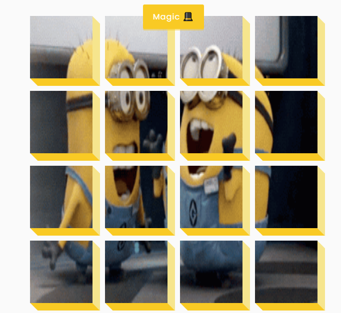

# 3d-boxes
In this project, I am creating interactive 3D boxes using a combination of HTML, CSS, and JavaScript. The design focuses on visually engaging elements where each box appears to rotate, flip, or scale in three-dimensional space, adding a dynamic effect.

